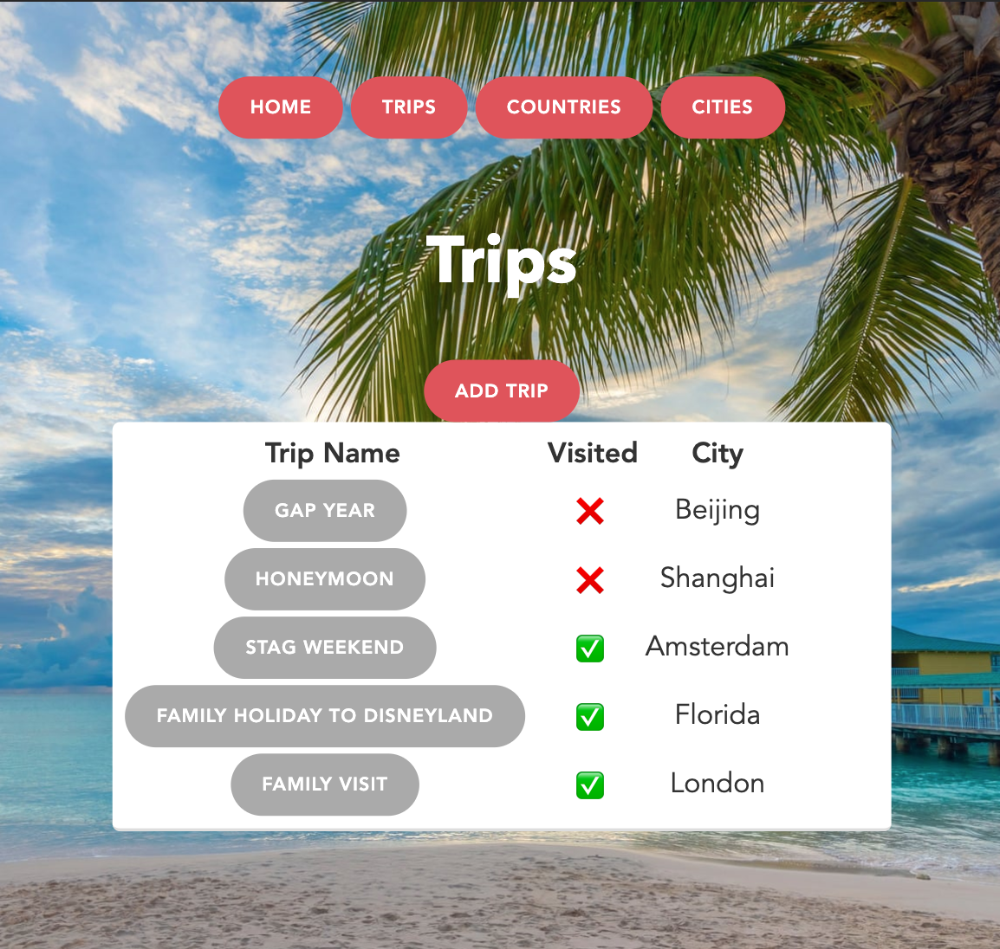

### RUBY PROJECT: Travel Bucket List



After 4 weeks of learning Ruby, postgreSQl and using the Sinatra web framework I was tasked with the following brief...

## BRIEF:

Build an app to track someone's travel adventures.

 * The app should allow the user to track countries and cities they want to visit and those they have visited.
 * The user should be able to create, edit and delete countries
 * Each country should have one or more cities to visit
 * The user should be able to create, edit and delete cities
 * The app should allow the user to mark destinations as visited or still to see

## You can view the app I created on Heroku:

https://travelcheck.herokuapp.com


## Running on your local device

CD into project folder and enter the following command in the terminal to start Sinatra

```ruby app.rb```

Then from your browser enter the following address

```localhost:4567``` 
